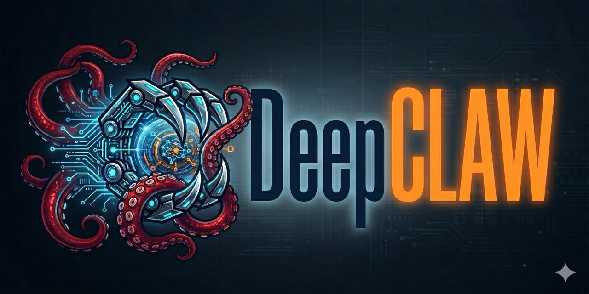

<p align="center">
  
</p>

# DeepClaw

A self-hosted AI assistant you talk to over Telegram. It can read your files, run shell commands, search the web, schedule tasks, and remember your preferences across conversations. Built on [LangChain DeepAgents](https://github.com/langchain-ai/deepagents).

## What It Can Do

- **File operations** — read, write, edit, search (glob/grep) files on your machine
- **Shell commands** — execute commands with a layered safety system that blocks dangerous operations
- **Web search** — search the web and extract content from URLs (via Tavily)
- **Persistent memory** — learns your preferences and remembers context across conversations
- **Cron scheduling** — run agent prompts on a schedule ("summarize my todos every morning at 9am")
- **Heartbeat monitoring** — periodic proactive checks that only notify you when something needs attention
- **Customizable personality** — define your agent's voice and behavior via SOUL.md
- **Subagent delegation** — specialized agents for research, coding, and sysadmin tasks

## Quick Start

### 1. Install

```bash
uv sync
```

### 2. Create a Telegram bot

Message [@BotFather](https://t.me/BotFather) on Telegram and create a new bot. Copy the token.

```bash
export TELEGRAM_BOT_TOKEN=<your-telegram-bot-token>
```

### 3. Set your API key

```bash
export ANTHROPIC_API_KEY=<your-anthropic-key>
```

### 4. Run

```bash
uv run deepclaw
```

You should see log output confirming the bot is running.

### 5. Pair with your bot

On first launch, DeepClaw prints a **pairing code** to the terminal:

```
Pairing code: A1B2C3 — send /pair A1B2C3 to the bot on Telegram
```

Open your bot in Telegram and send `/pair A1B2C3`. You're now paired and the bot will respond to your messages. The pairing persists across restarts.

### 6. Start chatting

Send any message to the bot. Try:
- "What files are in my home directory?"
- "Search the web for today's top tech news"
- "Check if any of my git repos have uncommitted changes"

### Optional: web search tools

```bash
export TAVILY_API_KEY=<your-tavily-key>
uv sync --extra web
```

## Choosing a Model

DeepClaw defaults to `claude-sonnet-4-6` but supports any model via the `provider:model` format.

**Via config file:**
```yaml
# ~/.deepclaw/config.yaml
model: "openai:gpt-4o"
```

**Via environment variable:**
```bash
export DEEPCLAW_MODEL=openai:gpt-4o
```

Supported providers (requires the provider's API key and langchain package):

| Provider | Model example | API key env var | Package |
|---|---|---|---|
| Anthropic | `anthropic:claude-sonnet-4-6` | `ANTHROPIC_API_KEY` | (included) |
| OpenAI | `openai:gpt-4o` | `OPENAI_API_KEY` | `langchain-openai` |
| Google | `google-genai:gemini-2.5-pro` | `GOOGLE_API_KEY` | `langchain-google-genai` |
| Groq | `groq:llama-3.3-70b` | `GROQ_API_KEY` | `langchain-groq` |
| OpenRouter | `openrouter:anthropic/claude-sonnet-4` | `OPENROUTER_API_KEY` | `langchain-openrouter` |

Install additional providers as needed:
```bash
uv pip install langchain-openai  # for OpenAI models
```

## Running as a Daemon

For long-running deployment on macOS (launchd) or Linux (systemd):

```bash
uv run deepclaw service install   # install the service file
uv run deepclaw service status    # check status
uv run deepclaw service uninstall # remove it
```

Logs are written to `~/.deepclaw/logs/`.

## SOUL.md — Agent Personality

DeepClaw loads `~/.deepclaw/SOUL.md` to define your agent's personality. A default is seeded on first run. Edit it to make the agent yours:

```bash
$EDITOR ~/.deepclaw/SOUL.md
```

The default personality is direct, concise, and warm with a dry sense of humor — it matches your energy, shares opinions, and avoids filler. Change it to whatever you want: formal, playful, terse, verbose, domain-specific.

## Memory

DeepClaw has persistent memory via `~/.deepclaw/AGENTS.md`. The agent learns from your interactions — preferences, corrections, project context, workflow patterns — and writes observations back to this file.

Memory loads into the system prompt at session start and persists across conversations. The agent decides what's worth remembering (user preferences yes, small talk no, credentials never).

```bash
cat ~/.deepclaw/AGENTS.md    # see what it's learned
$EDITOR ~/.deepclaw/AGENTS.md # edit or clear it
```

## Skills

Skills are specialized workflows the agent discovers and uses when relevant. Add a skill by creating a subdirectory with a SKILL.md:

```
~/.deepclaw/skills/
└── web-research/
    └── SKILL.md
```

SKILL.md format:

```markdown
---
name: web-research
description: Structured approach to conducting thorough web research
---

# Web Research Skill

## When to Use
- User asks you to research a topic
...
```

The agent sees skill names and descriptions in its system prompt and reads the full content on demand.

## Subagents

The main agent can delegate tasks to specialized subagents via the `task` tool. Each subagent runs in an isolated conversation with its own system prompt, handles the work, and returns a clean summary.

Built-in subagents:

| Name | When the agent delegates to it |
|---|---|
| `researcher` | Thorough investigation, comparing sources, synthesizing information |
| `coder` | Focused coding jobs — writing functions, fixing tests, refactoring |
| `sysadmin` | System health checks, disk usage, process monitoring, log analysis |
| `general-purpose` | Anything that doesn't fit the specialists (provided by DeepAgents) |

The main agent decides when to delegate based on the task. You don't need to specify which subagent to use — just describe what you need and the agent routes it.

## Heartbeat

DeepClaw can run periodic proactive checks via a `HEARTBEAT.md` checklist. The agent reviews the checklist on a schedule and **only notifies you when something needs attention** — silent when everything is OK.

A default (commented-out) `HEARTBEAT.md` is seeded at `~/.deepclaw/HEARTBEAT.md`. Uncomment or add your own checks:

```markdown
# Heartbeat Checklist
- Check if any git repos in ~/projects have uncommitted changes
- Check disk usage and warn if any partition is above 90%
```

Enable in `~/.deepclaw/config.yaml` (see [Configuration](#configuration)).

## Cron Scheduler

Schedule agent prompts to run automatically and deliver results to Telegram:

```
/cron_add 0 9 * * * | Summarize my todo list and calendar for today
/cron_add */30 * * * * | Check if the staging deploy succeeded
```

Jobs are stored in `~/.deepclaw/cron/jobs.json` and managed via Telegram commands.

## Telegram Commands

| Command | Description |
|---|---|
| `/start` | Welcome message and pairing instructions |
| `/pair <code>` | Pair with the bot using the code from the server terminal |
| `/new` | Start a fresh conversation thread |
| `/status` | Show current thread ID, model, and allowlist info |
| `/help` | List available commands |
| `/cron` | List all scheduled jobs |
| `/cron_add <expr> \| <prompt>` | Add a scheduled job |
| `/cron_rm <id_prefix>` | Remove a scheduled job by ID prefix |
| `/safety_test <cmd>` | Check a shell command for dangerous patterns |
| `/doctor` | Run system diagnostics |

## Configuration

DeepClaw loads configuration from three layers (highest precedence first):

1. Shell environment variables
2. `~/.deepclaw/.env` file
3. `~/.deepclaw/config.yaml` file

### Environment Variables

| Variable | Required | Description |
|---|---|---|
| `TELEGRAM_BOT_TOKEN` | Yes | Telegram Bot API token from [@BotFather](https://t.me/BotFather) |
| `ANTHROPIC_API_KEY` | Yes* | Anthropic API key (default provider) |
| `OPENAI_API_KEY` | No | OpenAI API key (if using OpenAI models) |
| `DEEPCLAW_MODEL` | No | Model override, e.g. `openai:gpt-4o` (defaults to `claude-sonnet-4-6`) |
| `DEEPCLAW_ALLOWED_USERS` | No | Comma-separated Telegram user IDs or usernames for access control |
| `TAVILY_API_KEY` | No | Tavily API key for web search and extract tools |

*Or whichever provider API key matches your chosen model.

### Config File

```yaml
# ~/.deepclaw/config.yaml
model: "claude-sonnet-4-6"
telegram:
  bot_token: "..."
  allowed_users:
    - "123456789"
    - "myusername"
  streaming:
    enabled: true
    edit_interval: 1.0
    buffer_threshold: 100
heartbeat:
  enabled: true
  interval_minutes: 30
  notify_chat_id: "123456789"
  quiet_hours_start: 23
  quiet_hours_end: 8
  timezone: "America/Los_Angeles"
  max_failures: 3
workspace:
  root: "~/.deepclaw/workspace"
```

## Safety

DeepClaw includes a layered safety system that gates tool execution:

- **Shell command gating** — every command is checked against 34+ dangerous patterns. Critical commands (`rm -rf`, `mkfs`, `dd`, `DROP TABLE`, fork bombs) are **hard-blocked**. Warning-level commands (`git push --force`, `chmod -R`) trigger a **human-in-the-loop** approval via Telegram.
- **Write path deny list** — blocks writes to sensitive paths: `~/.ssh/`, `~/.aws/`, `~/.gnupg/`, shell configs, system files.
- **SSRF protection** — URL fetches are validated against private/internal network ranges. DNS failures are fail-closed.
- **Credential redaction** — tool output is scanned for secret patterns (API keys, tokens, passwords) and redacted before reaching the LLM or Telegram.
- **Environment scrubbing** — child processes receive a filtered environment. Variables containing `KEY`, `TOKEN`, `SECRET`, `PASSWORD`, etc. are stripped.
- **Access control** — bot is locked by default. Users must pair via a one-time code before the agent responds.

This is defense-in-depth, not a sandbox. The safety patterns catch common dangerous commands but cannot prevent all possible destructive actions (e.g., a Python script calling `shutil.rmtree`). Run DeepClaw in an environment you're comfortable giving an AI agent access to.

## Tool Plugins

DeepClaw auto-discovers tool plugins from `deepclaw/tools/` at startup. A plugin loads only if its dependencies are installed and required env vars are set.

| Plugin | Install | Env Var | Tools |
|---|---|---|---|
| `web_search` | `uv sync --extra web` | `TAVILY_API_KEY` | `web_search`, `web_extract` |

To add a new tool plugin, create a module in `deepclaw/tools/` that exports:
- `available() -> bool` — checks if deps and env vars are present
- `get_tools() -> list` — returns tool callables

## Diagnostics

Run `uv run deepclaw doctor` to check your setup — config files, API keys, workspace, checkpointer, service installation, and more.

## Project Structure

```
deepclaw/
  pyproject.toml        # Dependencies and entry points
  deepclaw/
    cli.py              # CLI entry point (bot, doctor, service)
    agent.py            # Agent factory, SOUL/memory/skills setup
    config.py           # Layered config loader (env > .env > yaml)
    gateway.py          # Shared message handler with streaming
    channels/
      base.py           # Abstract Channel interface
      telegram.py       # Telegram bot with streaming responses
    safety.py           # Command detection, SSRF, credential redaction
    middleware.py       # SafetyMiddleware — gates tool calls
    auth.py             # User pairing and allowlist
    scheduler.py        # Cron scheduler
    heartbeat.py        # Periodic proactive monitoring
    service.py          # systemd/launchd service management
    doctor.py           # Diagnostic health checks
    tools/
      __init__.py       # Plugin discovery
      web_search.py     # Tavily web search + extract
      cron.py           # Cron management tools
  tests/
```

## Roadmap

- Discord, Slack, and more channels
- Image and document handling
- File sending back to chat
- Smart model routing
- Hybrid memory search
